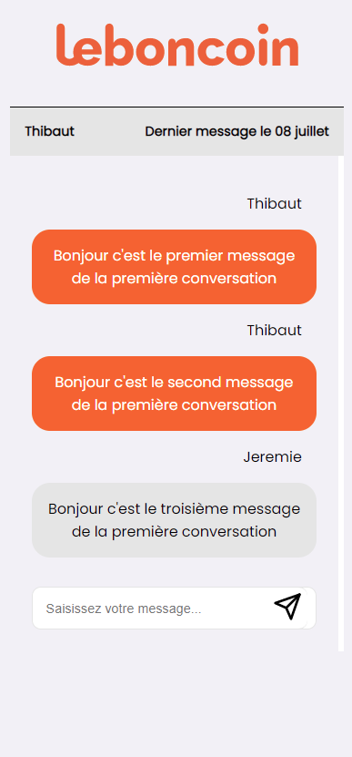

# LBC-techTest

# About the project

This project is made to allow users to see a list of conversations and interact in each conversations by sending new messages.
Users can also create new conversations with the user of their choice.

# Setup / Installation :

First, clone this repository in a folder of your choice and install the dependencies : 

`
npm install
`

Then, launch the server by running the command : 

`
npm run start-server
`

Finally, launch the app by running the command : 

`
npm run dev
`

# Approach :

The idea was to make things easy so here are the main steps I followed to achieve my goal !

- Fetching all the conversations from the `db.json` in the `index.tsx` and render a component `Conversations.tsx` that handle the UI and render the conversations listing.
- In the `Conversations.tsx` there is a button which redirect users to a page which handle the conversation selected with the route `/conversation/:id` when clicked.
- The `conversationId.tsx` page fetch the messages according to the id of the current conversation that we get from the router query and it also get the conversation object. Finally it renders a component `Messages.tsx` which handle the UI.
- In the `Messages.tsx` component we build a new Messages object to get the authorId, senderId and the corresponding messages. 
- Bonus : In the homepage there is a button to create a conversation which show a nice Modal to select the user we want and then create the conversation accordingly :)

  
Click to see the screenshots

  
Mobile list :

Desktop list :

Mobile conversation :

Desktop conversation :

# Status :

This the V1 of the application. 

In the V2 I'm planning to make these adjustements : 

- Inserting the date of the last message received in the list of conversations and in the conversation itself
- Handle the potential server crash and show message to the users
- Do more testings !
- Do more optimizations like using `useMemo` hook or memoizing react components !

# Technologies Used :

I used less technologies as possible : 

- `Axios` to post conversation or message
- `react-feather` for icons
- `moment.js` to deal with dates

### API

The API used in this project can be found here : [https://leboncoin.tech/frontend-technical-test/](https://leboncoin.tech/frontend-technical-test/).